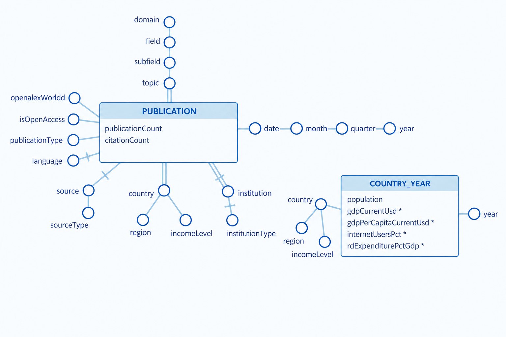
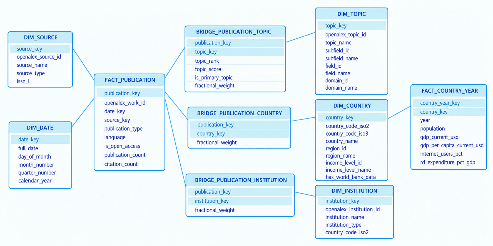

# Global AI Research Observatory

**An end-to-end Data Warehousing project for analysing the evolution, geography, thematic structure, and socioeconomic context of global Artificial Intelligence research.**

Global AI Research Observatory is an academic Data Management project that integrates a year-stratified sample of OpenAlex publications with World Bank World Development Indicators for 2018-2025. Heterogeneous source records pass through a natural-key reconciled layer before being loaded into a PostgreSQL dimensional fact constellation. Two facts, five dimensions, and three many-to-many bridges support six validated standalone OLAP sessions. A Streamlit and Plotly dashboard provides an interactive analytical interface over the same warehouse; the Data Warehouse, rather than the dashboard, is the project's central artifact.


## Contents

- [Project Overview](#1-project-overview)
- [Research and Analytical Questions](#2-research-and-analytical-questions)
- [Data Sources and Corpus Definition](#3-data-sources-and-corpus-definition)
- [System Architecture](#4-system-architecture)
- [Data Processing Pipeline](#5-data-processing-pipeline)
- [Data Warehouse Design](#6-data-warehouse-design)
- [OLAP Analysis](#7-olap-analysis)
- [Validated Analytical Results](#8-validated-analytical-results)
- [Interactive Dashboard](#9-interactive-dashboard)
- [Repository Structure](#10-repository-structure)
- [Installation and Environment](#12-installation-and-environment)
- [Running the Project](#13-running-the-project)
- [Testing and Validation](#14-testing-and-validation)
- [Reproducibility](#15-reproducibility)
- [Data Quality and Methodological Limitations](#16-data-quality-and-methodological-limitations)
- [Presentation and Demo](#17-presentation-and-demo)

## 1. Project Overview

The project studies how the observed AI research landscape changes over time, across countries and income groups, and across research topics. OpenAlex provides publication events and multivalued bibliographic relationships; the World Bank provides annual socioeconomic context at economy level. Their integration supports comparisons with population, GDP, digital access, and R&D expenditure without joining records at incompatible grains.

This is a Data Warehousing project because it integrates heterogeneous sources into a stable analytical model; separates extraction, reconciliation, dimensional loading, and consumption; declares fact grains and measure semantics; uses a conformed geography dimension and relationship bridges; and supports roll-up, drill-down, slicing, ranking, normalization, and drill-across. The six SQL sessions remain executable independently of the dashboard.

## 2. Research and Analytical Questions

1. **Research Growth:** how did observed AI research output evolve from 2018 to 2025?
2. **Geographic Full vs Fractional Counting:** how does country leadership change under full and fractional attribution?
3. **Normalized Leadership per Million:** which countries lead after fractional output is normalized by population?
4. **Income-Level Fractional Share:** how is country-attributed research participation distributed across World Bank income levels?
5. **Topic Annual Shares:** how did the annual non-exclusive shares of the cumulatively leading topics evolve?
6. **Wealth vs AI Research Intensity:** what descriptive association is visible between GDP per capita and population-normalized AI research intensity?

## 3. Data Sources and Corpus Definition

### 3.1 OpenAlex

[OpenAlex](https://openalex.org/) supplies work identifiers, DOI and title, publication date and type, language, cumulative citation count, Open Access flag, primary source, topics, authorship countries, and institutions.

Corpus membership is determined only by the work's **Primary Topic**: its OpenAlex subfield must be Artificial Intelligence (`1702`). The extractor applies that rule separately to each publication year from 2018 through 2025, admits `article`, `review`, `conference-paper`, `preprint`, `book`, and `book-chapter`, and excludes retracted works. After a work qualifies, all topics in its `topics` array are retained for thematic analysis. Associated topics enrich the topic bridge but do not determine inclusion.

### 3.2 World Bank World Development Indicators

The [World Bank Indicators API](https://datahelpdesk.worldbank.org/knowledgebase/topics/125589-developer-information) supplies annual socioeconomic observations. The extractor verifies World Development Indicators as source `2`, excludes aggregate entities using country metadata, and retains 217 real countries/economies across 2018-2025.

| WDI indicator | Warehouse measure |
|---|---|
| `SP.POP.TOTL` | `population` |
| `NY.GDP.MKTP.CD` | `gdp_current_usd` |
| `NY.GDP.PCAP.CD` | `gdp_per_capita_current_usd` |
| `IT.NET.USER.ZS` | `internet_users_pct` |
| `GB.XPD.RSDV.GD.ZS` | `rd_expenditure_pct_gdp` |

The extractor creates a complete 217 x 8 Country x Year skeleton (1,736 rows) and overlays available observations. Source missing values remain `NULL`; no interpolation, imputation, or zero substitution is performed.

### 3.3 Corpus and Sampling

The frozen OpenAlex extraction recorded **1,487,116 qualifying works**. The final analytical corpus contains **50,000 unique sampled works**:

1. count the qualifying population independently for each year;
2. allocate 50,000 observations proportionally across the eight annual strata;
3. resolve integer allocations by deterministic largest-remainder rounding, with ascending year as the tie-break;
4. request each annual OpenAlex native sample using master seed `20260910 + publication year`;
5. validate year, type, retraction state, Primary Topic boundary, dates, uniqueness, allocation totals, and checksum; and
6. atomically publish the JSONL and provenance manifest after all checks pass.

The annual allocation is 4,541, 5,016, 5,443, 5,773, 5,661, 6,601, 7,598, and 9,367 works for 2018-2025 respectively. These counts describe a sample, not the complete qualifying population.

Country-based analyses cover **32,384 of 50,000 sampled works (64.8%)**. Works without an identifiable country relationship remain in the publication fact but are excluded from geographic analyses.

## 4. System Architecture

```text
OpenAlex API                         World Bank WDI API
     |                                      |
     v                                      v
OpenAlex JSONL + manifest        Country-Year JSONL + manifest
     |                              + quality report
     +-------------------+------------------+
                         v
                 Reconciled Layer
              natural/source-key model
                         |
                         v
              Dimensional Data Warehouse
                  fact constellation
                         |
                         v
                 OLAP SQL Sessions
                         |
                         v
              Streamlit / Plotly Dashboard
```

- **Raw layer:** source-oriented JSONL plus provenance and quality metadata.
- **Reconciled layer:** consistent natural identities and deduplicated relationships, separate from dimensional surrogate keys.
- **Dimensional warehouse:** two facts, five dimensions, and three many-to-many bridges in schema `dw`; `dim_country` is the shared conformed geography dimension.
- **Analytical layer:** six standalone, read-only PostgreSQL sessions and parameterized dashboard queries.
- **Presentation layer:** a Streamlit interface over the warehouse; it does not replace the SQL analyses.

## 5. Data Processing Pipeline

### 5.1 Extraction

[`extraction/extract_openalex.py`](extraction/extract_openalex.py) implements Primary-Topic selection, proportional allocation, native sampling, deduplication, guardrail validation, atomic JSONL publication, and a SHA-256 provenance manifest. [`extraction/extract_world_bank.py`](extraction/extract_world_bank.py) retrieves metadata and observations, excludes aggregates, pivots them onto the Country x Year skeleton, validates ranges and uniqueness, and atomically writes the JSONL, manifest, and quality report.

### 5.2 Reconciliation

[`reconciliation/load_reconciled.py`](reconciliation/load_reconciled.py) verifies the OpenAlex checksum when its companion manifest is present, normalizes identifiers and types, reconciles ISO geography, deduplicates relationship pairs, and preserves optional missing values. The nine tables in [`reconciliation/schema.sql`](reconciliation/schema.sql) are:

- entities: `r_work`, `r_topic`, `r_country`, `r_institution`, `r_source`;
- relationships: `r_work_topic`, `r_work_country`, `r_work_institution`; and
- observations: `r_country_year_indicator`.

`r_work_country` uses the unique country codes found in authorships and their institutions. Recognized OpenAlex geographies absent from the frozen World Bank master are retained with `has_world_bank_data = FALSE`; in this corpus, that applies to Taiwan (`TW`). No socioeconomic observations are fabricated.

### 5.3 Dimensional Loading

[`warehouse/load_dw.py`](warehouse/load_dw.py) checks the reconciled contract and performs set-based inserts into [`warehouse/schema.sql`](warehouse/schema.sql). Identity surrogate keys are generated for countries, topics, institutions, sources, and both facts; `dim_date.date_key` is integer `YYYYMMDD`. Natural source identifiers remain alternate keys.

The loader creates `publication_count = 1`, retains source `NULL` values, computes each bridge weight as `1 / number of unique members`, checks natural and grain uniqueness, compares warehouse counts and measures with the reconciled source, detects orphans, and verifies that weights sum to one for every publication represented in each bridge.

### 5.4 Validation and Data Quality

Both PostgreSQL loaders rebuild only their own schema inside a transaction. Validation failure rolls back the replacement; re-running a loader is idempotent for unchanged inputs. Checks cover allocation totals, source boundaries, duplicates, date/year agreement, Primary Topic membership, Country x Year completeness, relationship uniqueness, null preservation, referential integrity, fact grains, row counts, and bridge weights. The World Bank quality report records coverage and range warnings without changing source values.

## 6. Data Warehouse Design

### 6.1 Dimensional Fact Model



The DFM contains two facts:

- **Publication:** one sampled publication, measured by publication and cumulative citation counts. It connects directly to Date and Source and has multivalued Topic, Country, and Institution relationships.
- **Country-Year:** one observed economy x calendar year, measured by population, GDP, GDP per capita, internet use, and R&D expenditure.

The conceptual hierarchies are Date -> Month -> Quarter -> Year; Topic -> Subfield -> Field -> Domain; Country -> Region or Income Level; Source -> Source Type; and Institution -> Institution Type. Country-Year retains Year as its separate coordinate, as shown in the final DFM.

### 6.2 Physical Fact Constellation

The repository contains two complementary visualizations of the physical warehouse:

- [`schemas/Complete_Fact_Constellation.png`](schemas/Complete_Fact_Constellation.png) is the **schema-complete implementation diagram**. Its table and column names mirror the physical PostgreSQL warehouse defined in [`warehouse/schema.sql`](warehouse/schema.sql) and it is the reference diagram for the actual database.
- [`schemas/Fact_Constellation.png`](schemas/Fact_Constellation.png) is a **simplified presentation-oriented diagram** used in the slide deck. It preserves the same warehouse structure while shortening selected labels for readability during presentation.

The complete implementation diagram is shown below.



The design is a **fact constellation** because two facts coexist and share the conformed `dim_country` geography dimension:

- **facts:** `fact_publication`, `fact_country_year`;
- **dimensions:** `dim_date`, `dim_country`, `dim_topic`, `dim_institution`, `dim_source`;
- **bridges:** `bridge_publication_country`, `bridge_publication_topic`, `bridge_publication_institution`.

`fact_publication` uses `dim_date`; `fact_country_year` stores `year` as a degenerate coordinate and has no `dim_year` foreign key. This preserves the facts' different time grains.

### 6.3 Fact Grains

| Fact | Grain | Keys enforcing the grain | Main measures |
|---|---|---|---|
| `fact_publication` | One sampled OpenAlex work | Identity `publication_key`; unique `openalex_work_id` | `publication_count`, `citation_count` |
| `fact_country_year` | One retained World Bank economy x calendar year | Identity `country_year_key`; unique (`country_key`, `year`) | `population`, `gdp_current_usd`, `gdp_per_capita_current_usd`, `internet_users_pct`, `rd_expenditure_pct_gdp` |

Date and Source foreign keys are nullable because missing optional data do not create artificial members. Country-Year requires a country but permits missing measures.

### 6.4 Many-to-Many Relationships and Bridge Tables

| Bridge | Relationship | Additional attributes |
|---|---|---|
| `bridge_publication_country` | Publication <-> Country | `fractional_weight` |
| `bridge_publication_topic` | Publication <-> Topic | `topic_rank`, `topic_score`, `is_primary_topic`, `fractional_weight` |
| `bridge_publication_institution` | Publication <-> Institution | `fractional_weight` |

**Full counting** assigns one publication to every participating member. **Fractional counting** assigns `1 / n` to each of the `n` unique members in that relationship. A two-country publication contributes 0.5 to each country regardless of its topic or institution count. The three weights are relationship-specific and never rescaled after filtering.

Dashboard filters over independent bridges use correlated `EXISTS` semi-joins. Analytical queries then join only their attribution bridge, preventing cross-bridge fan-out.

### 6.5 Measure Semantics and Additivity

| Measure | Aggregation semantics |
|---|---|
| `publication_count` | Additive across publication rows and time. Full bridge participation can exceed the corpus count because memberships are non-exclusive. |
| Bridge `fractional_weight` | Additive across publications within one relationship; sums to one only for publications represented in that bridge. |
| `citation_count` | Additive across publications as a cumulative extraction-time snapshot; comparisons across years are age-biased. |
| `population` | Additive across countries for a fixed year, but non-additive across years. |
| `gdp_current_usd` | A flow measure that can be aggregated for suitable questions; cross-year sums in current USD are not used in the analyses because values from different years are not directly comparable without further adjustment. |
| GDP per capita and percentages | Non-additive; they must not be summed. |
| Shares and normalized rates | Derived, non-additive measures recomputed from compatible numerators and denominators. |

### 6.6 Cross-Fact Drill-Across

The facts cannot be joined row by row. Publication output is first attributed through `bridge_publication_country` and aggregated to **Country x Year**. Only then is it joined to `fact_country_year` on country and year. Population-normalized research intensity is calculated only after this compatible-grain drill-across, while socioeconomic measures such as GDP per capita are retained for compatible Country x Year comparisons. Missing or zero denominators yield `NULL`.

## 7. OLAP Analysis

All six files are executable PostgreSQL scripts wrapped in read-only transactions.

| No. | Session and question | Dimensions | Measures | OLAP / analytical operations | SQL file |
|---:|---|---|---|---|---|
| 01 | **Research Growth:** how did observed output evolve from 2018 to 2025? | Date; publication type; Open Access | Publications; period growth | Year roll-up; quarter/month drill-down; slice; lag | [`session_01_research_growth.sql`](analysis/session_01_research_growth.sql) |
| 02 | **Geographic Full vs Fractional:** how does attribution change leadership? | Country; Year; Region; Income Level | Full/fractional output; ranks; shift | Slice; country drill-down; ranking | [`session_02_geographic_full_vs_fractional.sql`](analysis/session_02_geographic_full_vs_fractional.sql) |
| 03 | **Normalized Leadership:** which countries lead per million? | Country; Year; Region; Income Level | Full support; fractional output; population; per-million rate | Drill-across; normalization; threshold; ranking | [`session_03_normalized_leadership.sql`](analysis/session_03_normalized_leadership.sql) |
| 04 | **Income-Level Fractional Share:** how is output distributed by income group? | Country -> Income Level; Year | Full/fractional output; share; population; intensity | Roll-up; complete grid; annual share | [`session_04_income_level_fractional_share.sql`](analysis/session_04_income_level_fractional_share.sql) |
| 05 | **Topic Annual Shares:** how did leading topics evolve? | Topic; Year | Topic participation; annual/cumulative publications; share | Period dice; cumulative Top-N; fixed-set tracking | [`session_05_topic_annual_shares.sql`](analysis/session_05_topic_annual_shares.sql) |
| 06 | **Wealth vs AI Intensity:** what association is visible? | Country; Year; Region; Income Level | Full support; fractional output; population; GDP per capita; per-million rate; pair count | Drill-across; threshold; complete-case slice | [`session_06_wealth_vs_ai_intensity.sql`](analysis/session_06_wealth_vs_ai_intensity.sql) |

Sessions 03 and 06 apply a 30-full-participation threshold after Country x Year aggregation; it is a descriptive stability rule, not a significance test. Session 04 rolls countries up to four named income groups. Session 05 fixes the cumulative Top 4 over 2018-2025 and tracks their annual non-exclusive shares. Its denominator is all sampled publications in each year, so topic shares need not sum to 100%. Session 06 returns paired observations for interpretation or plotting; it does not estimate a causal model.

## 8. Validated Analytical Results

- Output rises from **4,541 publications in 2018** to **9,367 in 2025**, approximately **+106.3%**; the series includes a 2022 decline from 5,773 to 5,661.
- In 2025, China has **1,754 full** and **1,511.498 fractional** publications; the United States has **1,106 full** and **817.341 fractional**.
- With the 30-publication threshold, the 2024 per-capita leaders are Singapore (**6.982 fractional publications per million**) and Hong Kong SAR, China (**5.498**).
- In 2024, per-million intensity is **1.702** for High income, **0.632** for Upper middle income, **0.203** for Lower middle income, and **0.021** for Low income, using matched populations.
- The cumulative Top 4 are Topic Modeling (**6,188** participations), Natural Language Processing Techniques (**5,443**), Neural Networks and Applications (**2,446**), and Anomaly Detection Techniques and Applications (**2,382**).
- The 2024 wealth-intensity slice contains **37 complete country pairs** after the support threshold. Its visual association is descriptive, not causal.

## 9. Interactive Dashboard

The dashboard uses Streamlit, Plotly, pandas, and Psycopg 3. [`dashboard/db.py`](dashboard/db.py) opens parameterized, server-enforced read-only connections. [`dashboard/queries.py`](dashboard/queries.py) declares warehouse-grain queries and bridge-safe filters; [`dashboard/views.py`](dashboard/views.py) renders the pages.

Global controls cover year range, country, region, income level, topic, subfield, field, domain, institution type, source type, publication type, language, Open Access, and full/fractional attribution. Missing values remain selectable, and weights are not renormalized after filtering.

The nine pages are Overview, Research Growth, Geographic Leadership, Normalized Leadership, Socioeconomic Context, Topics, Institutions, Publication Ecosystem, and Citation Impact. They add Top-N controls, temporal navigation, denominator selection, support thresholds, and CSV export. Normalized country measures always use fractional attribution regardless of the global selector. The SQL files remain the canonical standalone analyses.

## 10. Repository Structure

The tree below represents the version-controlled repository. Generated source snapshots, manifests, and quality reports are written under `data/raw/` during extraction and are intentionally excluded from version control.

```text
global-ai-research-observatory/
|-- analysis/
|   |-- olap_smoke.sql
|   |-- session_01_research_growth.sql
|   |-- session_02_geographic_full_vs_fractional.sql
|   |-- session_03_normalized_leadership.sql
|   |-- session_04_income_level_fractional_share.sql
|   |-- session_05_topic_annual_shares.sql
|   `-- session_06_wealth_vs_ai_intensity.sql
|-- dashboard/
|   |-- app.py                |-- db.py
|   |-- queries.py            |-- ui.py
|   |-- views.py              `-- requirements.txt
|-- data/raw/
|   `-- .gitkeep
|-- extraction/
|   |-- extract_openalex.py   `-- extract_world_bank.py
|-- reconciliation/
|   |-- schema.sql            `-- load_reconciled.py
|-- warehouse/
|   |-- schema.sql            `-- load_dw.py
|-- schemas/
|   |-- DFM.png
|   |-- Complete_Fact_Constellation.png
|   |-- Fact_Constellation.png
|   `-- reconciled_layer.jpg
|-- presentation/
|   `-- Global AI Research Observatory.pdf
|-- tests/
|   |-- test_extract_openalex.py
|   |-- test_extract_world_bank.py
|   |-- test_reconciled_layer.py
|   |-- test_load_dw.py
|   |-- test_dashboard.py
|   `-- test_launcher.py
|-- .gitignore
|-- .streamlit/config.toml
|-- run_dashboard.py
`-- README.md
```

## 11. Core Files Guide

| Path | Purpose |
|---|---|
| [`extraction/extract_openalex.py`](extraction/extract_openalex.py) | Defines the AI boundary and produces the validated 50,000-work sample and manifest. |
| [`extraction/extract_world_bank.py`](extraction/extract_world_bank.py) | Retrieves WDI data, excludes aggregates, builds the skeleton, and writes quality metadata. |
| [`reconciliation/schema.sql`](reconciliation/schema.sql) | Defines the nine-table natural/source-key model. |
| [`reconciliation/load_reconciled.py`](reconciliation/load_reconciled.py) | Validates, reconciles, and transactionally loads schema `reconciled`. |
| [`warehouse/schema.sql`](warehouse/schema.sql) | Defines the physical fact constellation in schema `dw`. |
| [`warehouse/load_dw.py`](warehouse/load_dw.py) | Loads dimensions, facts, and bridges and runs integrity checks. |
| [`analysis/session_01_research_growth.sql`](analysis/session_01_research_growth.sql) | Growth and temporal drill-down. |
| [`analysis/session_02_geographic_full_vs_fractional.sql`](analysis/session_02_geographic_full_vs_fractional.sql) | Country full/fractional rankings. |
| [`analysis/session_03_normalized_leadership.sql`](analysis/session_03_normalized_leadership.sql) | Per-million Country x Year drill-across. |
| [`analysis/session_04_income_level_fractional_share.sql`](analysis/session_04_income_level_fractional_share.sql) | Income-level share and intensity. |
| [`analysis/session_05_topic_annual_shares.sql`](analysis/session_05_topic_annual_shares.sql) | Fixed Top-4 topic shares. |
| [`analysis/session_06_wealth_vs_ai_intensity.sql`](analysis/session_06_wealth_vs_ai_intensity.sql) | Complete GDP-per-capita/intensity pairs. |
| [`analysis/olap_smoke.sql`](analysis/olap_smoke.sql) | Compact grain and null-semantics integration checks. |
| [`dashboard/queries.py`](dashboard/queries.py) | Parameterized query and filter layer. |
| [`dashboard/app.py`](dashboard/app.py), [`dashboard/views.py`](dashboard/views.py), [`dashboard/ui.py`](dashboard/ui.py) | Entry point, page renderers, transformations, and UI helpers. |
| [`dashboard/db.py`](dashboard/db.py) | Read-only Psycopg boundary. |
| [`schemas/DFM.png`](schemas/DFM.png) | Final conceptual Dimensional Fact Model. |
| [`schemas/Complete_Fact_Constellation.png`](schemas/Complete_Fact_Constellation.png) | Schema-complete physical warehouse diagram whose table and column names mirror the implemented PostgreSQL schema. |
| [`schemas/Fact_Constellation.png`](schemas/Fact_Constellation.png) | Simplified presentation-oriented version of the same fact constellation used in the slide deck. |
| [`schemas/reconciled_layer.jpg`](schemas/reconciled_layer.jpg) | Reconciled-layer relational diagram. |
| [`tests/`](tests/) | Extraction, PostgreSQL, warehouse, SQL, dashboard, rendering, and launcher tests. |
| [`run_dashboard.py`](run_dashboard.py) | Dependency/database preflight and Streamlit launcher. |
| [`presentation/Global AI Research Observatory.pdf`](presentation/Global%20AI%20Research%20Observatory.pdf) | Final 19-page presentation. |

## 12. Installation and Environment

### 12.1 Requirements

- Python **3.11 or newer** (enforced by the launcher).
- PostgreSQL and the `psql`/`createdb` clients.
- Schema-creation privileges; tests also require permission to create/drop temporary databases.
- Network access for live extraction.
- Packages in [`dashboard/requirements.txt`](dashboard/requirements.txt): Psycopg 3, pandas, Plotly, and Streamlit.

### 12.2 Environment Variables

| Variable | Meaning |
|---|---|
| `DATABASE_URL` | PostgreSQL DSN used by both loaders and the dashboard. The launcher alone defaults to `postgresql:///global_ai_observatory`. |
| `TEST_DATABASE_URL` | Administrative DSN used by tests to create isolated databases; defaults to `postgresql:///postgres`. |
| `OPENALEX_API_KEY` | Optional OpenAlex credential used for live extraction. |
| `OPEN_ALEX_KEY` | Supported alias for `OPENALEX_API_KEY`. |

The OpenAlex extractor also reads either key from an ignored root `.env` file. Other components read the process environment directly. Never commit credentials.

### 12.3 Installation

```bash
python3 -m venv .venv
.venv/bin/python -m pip install --upgrade pip
.venv/bin/python -m pip install -r dashboard/requirements.txt

createdb global_ai_observatory
export DATABASE_URL=postgresql:///global_ai_observatory
```

## 13. Running the Project

### 13.1 Obtain the Raw Layer

Generated files under `data/raw/` are excluded by `.gitignore`; a fresh clone contains only `.gitkeep`. Place retained frozen artifacts there or create a new live snapshot:

```bash
.venv/bin/python extraction/extract_openalex.py
.venv/bin/python extraction/extract_world_bank.py
```

### 13.2 Load the Reconciled Layer

```bash
.venv/bin/python reconciliation/load_reconciled.py --validate-only
.venv/bin/python reconciliation/load_reconciled.py
```

Defaults are `data/raw/openalex_ai_works.jsonl` and `data/raw/world_bank_country_year.jsonl`; alternatives use `--openalex` and `--world-bank`.

### 13.3 Build the Data Warehouse

```bash
.venv/bin/python warehouse/load_dw.py
```

### 13.4 Execute the OLAP Sessions

```bash
psql "$DATABASE_URL" -X -v ON_ERROR_STOP=1 \
  -f analysis/session_01_research_growth.sql

for session in analysis/session_*.sql; do
  psql "$DATABASE_URL" -X -v ON_ERROR_STOP=1 -f "$session"
done
```

### 13.5 Run Preflight and the Dashboard

```bash
.venv/bin/python run_dashboard.py --check-only
.venv/bin/python run_dashboard.py
```

The launcher checks dependencies, compiles modules, validates required warehouse objects and columns, checks non-empty bridges and 2018-2025 coverage, and starts Streamlit. Direct execution is also supported when `DATABASE_URL` is set:

```bash
.venv/bin/python -m streamlit run dashboard/app.py
```

## 14. Testing and Validation

```bash
export TEST_DATABASE_URL=postgresql:///postgres
.venv/bin/python -m unittest discover -s tests -v
```

The test role must create/drop databases. Each PostgreSQL-backed class uses a uniquely named isolated database and removes it afterwards. If PostgreSQL or Psycopg is unavailable, those classes are skipped, so inspect the summary rather than treating a partial run as complete.

The final implementation passes **71 automated tests** (`Ran 71 tests ... OK`). They cover extraction invariants and retries; World Bank completeness and missingness; reconciliation identity, null, foreign-key, idempotency, and rollback behavior; dimensional grains, measures, bridge weights, orphan rejection, and rollback; all six SQL sessions; dashboard filters, queries, hierarchy roll-ups, rendering, and controls; and launcher preflight. No coverage percentage is claimed because no coverage report exists.

## 15. Reproducibility

### 15.1 Frozen-Snapshot Reproducibility

- The OpenAlex manifest records method, timestamp, filters, types, annual populations, allocation, seeds, actual counts, API activity, and the JSONL SHA-256; reconciliation verifies the hash when the companion manifest exists.
- The World Bank manifest records endpoints, parameters, indicator lineage, excluded aggregates, row counts, and missingness; its quality report records skeleton and coverage checks.
- Outputs use deterministic ordering and atomic replacement.
- Both loaders transactionally replace only their own schema and validate before commit.
- Versioned SQL sessions and tests fix the analytical semantics.

Raw JSONL, manifests, and the quality report are Git-ignored because they are generated and large. A clone alone therefore does not contain the frozen analytical snapshot; it contains the code needed to create a new live snapshot or load retained frozen artifacts when they are supplied separately.

### 15.2 Live-Source Reproducibility

The procedure is deterministic for a fixed source state, but future API runs are not guaranteed to be bit-for-bit identical. OpenAlex can revise works, topics, citations, classifications, and the qualifying population; its native sample operates over that live state. World Bank observations and metadata can also be revised. Fixed seeds repeat the method, not the external databases.

## 16. Data Quality and Methodological Limitations

- **Sample, not census:** results describe 50,000 works from a qualifying population of 1,487,116 at extraction time.
- **Geographic coverage:** 32,384 works (64.8%) have a country relationship; the other 17,616 are excluded only from geographic analyses.
- **Equal-country fractionalization:** credit is divided equally across unique countries, not authors or author contribution.
- **Non-exclusive relationships:** full counts across topics, institutions, countries, or groups can exceed unique publication totals.
- **World Bank missingness:** of 1,736 rows, GDP and GDP per capita each have 95 missing values, internet use 446, and R&D expenditure 1,172; population has none. Missing denominators remain unavailable.
- **Unmatched geography:** Taiwan retains publication output but has no frozen World Bank facts, so normalized metrics are unavailable.
- **Static income classification:** extraction-time region and income attributes are applied across 2018-2025; historical annual classifications are not reconstructed.
- **Citation snapshot:** cumulative citations are affected by publication-age bias.
- **Live metadata:** source records can change after extraction.
- **Descriptive associations:** socioeconomic comparisons do not establish causality.

## 17. Presentation and Demo

The final presentation is [`presentation/Global AI Research Observatory.pdf`](presentation/Global%20AI%20Research%20Observatory.pdf). It covers source integration, reconciliation, dimensional design, bridge-aware counting, the six sessions, validated results, limitations, and the live dashboard demonstration.

## 18. Technologies

Python 3, PostgreSQL, Psycopg 3, pandas, Streamlit, Plotly, OpenAlex API, World Bank Indicators API v2, and `unittest`.

## 19. References

- [OpenAlex API documentation](https://docs.openalex.org/)
- [World Bank Indicators API documentation](https://datahelpdesk.worldbank.org/knowledgebase/topics/125589-developer-information)
- [PostgreSQL documentation](https://www.postgresql.org/docs/)
- [Psycopg 3 documentation](https://www.psycopg.org/psycopg3/docs/)
- [Streamlit documentation](https://docs.streamlit.io/)
- [Plotly Python documentation](https://plotly.com/python/)

## 20. Author and Academic Context

**Author:** Lorenzo Bertucci<br>
**Course:** Data Management, Academic Year 2025-2026<br>
**Project type:** University Data Warehousing project for academic evaluation and demonstration
